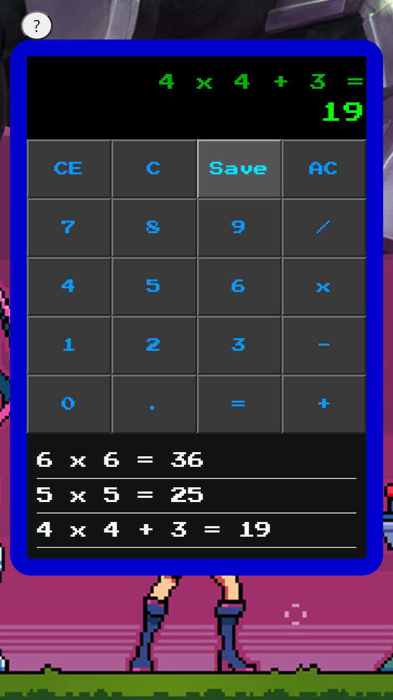

# Calculadora - Temática Fliperama League of Legends.

## Objetivo
* Criar uma página responsiva em web de uma calculadora em HTML5 e CSS para a composição da página.
* O processo da lógica da calculadora deverá ser desenvolvido em JavaScript, já os números e os botões e o visor da nossa calculadora deverão ser feitos com a tag <Form> em HTML5 e CSS
* Além de apresentar o resultado, no final mostrar o resultado do histórico da ação através de um alert. (Neste projeto optei por mostra histórico dentro da calculadora)

## Detalhes
* Nesse desafio foi permitido utilizar frameworks, bibliotecas e diversos outros recursos, mas que o principal o objetivo é desenvolver uma calculadora.
* Foi feita a correção em que ao virar o celular na horizontal, a calculadora não respondia visualmente.

## Desenvolvimento e Tecnologias
* Utilizei SASS para estilização do aplicativo.
* Aplicação Responsiva.
* Acessibidade via Teclado.
* Utilização da Modal com instruções sobre a calculadora.
    * Tentei usar o Bootstrap, mas limitava o desenvolvimento da aplicação
* Aplicação de efeitos sonoros das teclas númericas e especiais.
* Regex para tratamentos de exceções.

## Resultado
[Ver Calculadora](https://calculadora-gama-academy.vercel.app/)
#### Desktop

#### Mobile/Landscape

## Colaboradores
<table>
  <tr>
    <td align="center">
      <a href="#">
         
        
          <b>Lázaro Pimentel</b>
        
      </a>
    </td>
  </tr>
</table>

## Licença
The MIT License (MIT)

Copyright ©️ 2022 - Lázaro Pimentel